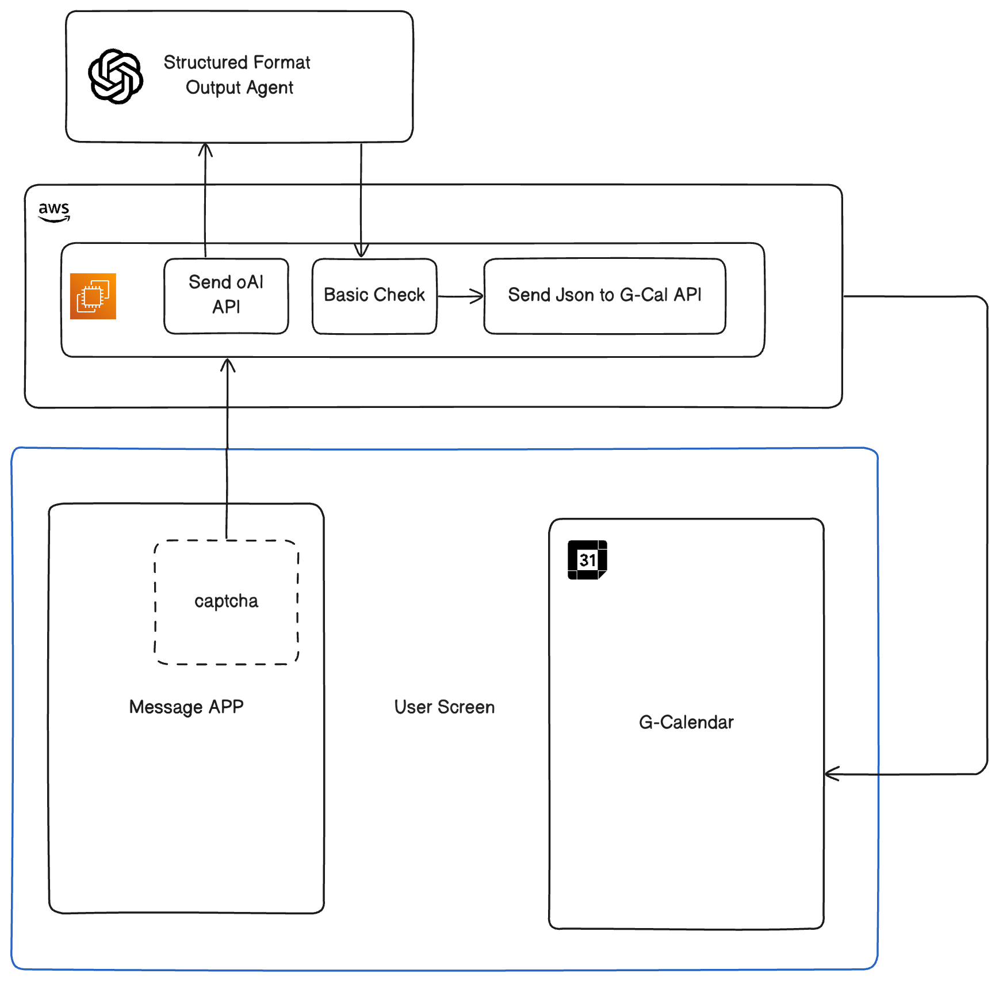

# autoCalendar

Automatically add Tasks and Reminders to your Google Calendar

## Overview

`autoCalendar` is a tool designed to simplify task management by automating the process of adding tasks and reminders to your Google Calendar. Many of us encounter tasks and reminders in various forms on our computers, and manually transferring them to a calendar can feel burdensome. `autoCalendar` leverages intelligent helper agents to detect tasks and reminders and seamlessly integrate them into your Google Calendar.

The overview of the system may look something like this:



## Features

- **Automated Task Detection**: Automatically recognize tasks and reminders from various input sources.
- **Google Calendar Integration**: Sync detected tasks directly to your Google Calendar.
- **Customizable Rules**: Define rules for how tasks and reminders are identified and scheduled.
- **User-Friendly Interface**: Simple and intuitive design for ease of use.

## How It Works

1. **Input Sources**: `autoCalendar` scans text-based inputs such as emails, notes, or documents for actionable tasks and reminders.
2. **Task Parsing**: Uses logical algorithms to parse input and identify important details like due dates, times, and task descriptions.
3. **Calendar Sync**: Automatically schedules tasks and reminders in your connected Google Calendar.

## Installation

1. Clone the repository:
   ```bash
   git clone https://github.com/yourusername/autocalendar.git
   cd autocalendar
   ```
2. Install the required dependencies:
   ```bash
   pip install -r requirements.txt
   ```
3. Set up Google Calendar API credentials:
   - Follow [this guide](https://developers.google.com/calendar/api/quickstart/python) to enable the Google Calendar API.
   - Download your `credentials.json` file and place it in the project root.
4. Run the application:
   ```bash
   python app.py
   ```

## Usage

1. Launch the application and connect your Google account.
2. Define any specific rules for detecting tasks and reminders.
3. Let `autoCalendar` handle the rest! Detected tasks will be automatically added to your Google Calendar.

## Configuration

Customize the `config.json` file to adjust detection rules and other application settings.

Example:
```json
{
  "task_keywords": ["todo", "reminder", "task"],
  "default_time": "09:00",
  "priority_levels": {
    "high": "red",
    "medium": "orange",
    "low": "blue"
  }
}
```
